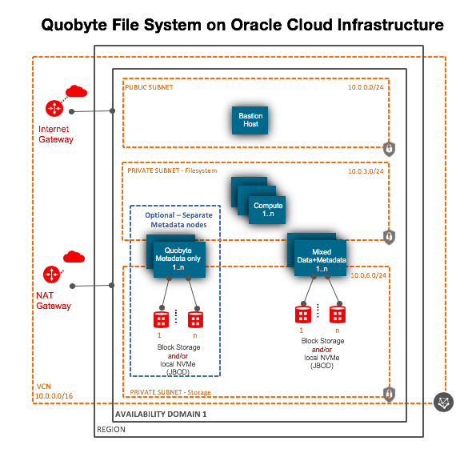
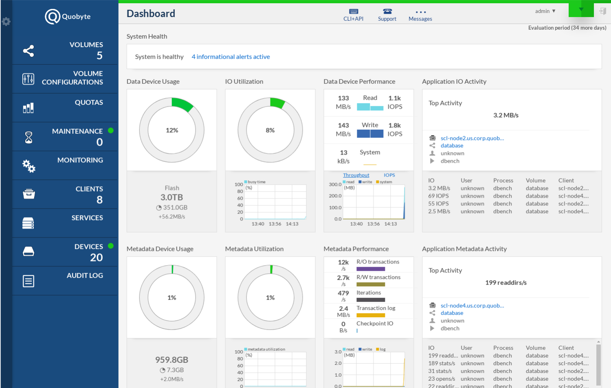

# oci-quobyte
Deploy [Quobyte file system](https://www.quobyte.com) on Oracle Cloud Infrastructure. The template will do the following: 

- Provision the infrastructure resources required to deploy the filesystem. This includes VCN, public, private, internet, nat gateways, security list,  compute instances and storage.   
- Deploys Quobyte filesystem.  Please plan to signup for a 45 day free license for  Quobyte [here](https://www.quobyte.com/signup).  
- Deploys client/compute node to mount the filesystem.
- You can deploy Quobyte on Bare metal or Virtual Machine compute nodes.  These node can be Standard, DenseIO (local SSD) or HPC compute shapes
- Minimum 4 fileserver nodes are required.
- Storage Tiering - You can use more than one storage type: local NVMe SSD (physically attached to the host machine) and different OCI Block Storage elastic performance tiers (Higher/Balanced/Lower Cost) to meet your storage performance and cost needs.   
- Using Bare metal nodes is recommended, so you can use 2x25Gbps NICs for optimal performance.

## High Level Architecture
Given below is the high level architecture. 

## Quobyte
#### Why Quobyte
- Parallel distributed POSIX file system
- Unlimited performance through scale out without bottlenecks
- Reliability through erasure coding and replication on local NVMe or through Block Volumes
- Easy to use and run, on VMs and bare metal servers
- Unified storage with native drivers for Linux, Windows, S3, HDFS, MPI-IO and TensorFlow
- Automatic tiering between storage media and clusters

#### Key Features
- Single namespace for File, S3, Hadoop, MPI, TensorFlow
- Multi-Tenancy with optional hardware isolation
- Policy-based data placement
- Fairness between IO streams, workloads and users on metadata
- Workload and user isolation
- Scalable range locks
- File striping
- Recoding for space efficiency
- Data mover between clusters
- Quotas without performance impact
- NFSv4 ACLs across all platforms
- IP-based and X.509-based access control
- Untrusted clients (X.509 certificate support)
- Unlimited number of volumes with thin provisioning

#### Differentiator from other Parallel FS/NAS solutions
- Shared-nothing, built-in data protection with synchronous, asynchronous replication and erasure coding
- User-space drivers for easy installation and updates without kernel modules
- Enterprise features such as automatic policy-based tiering, re-protection, expiration
- Reconfiguration and updates at any time without interruption
- MPI-IO support with kernel bypass

#### Workloads – it works well for
- Throughput workloads, e.g. machine learning, traditional HPC
- Small file workloads, e.g. fluid dynamics, EDA
- Random 4k IO

## Deployment Prerequisites
- Signup for a 45 day free license for  Quobyte [here](https://www.quobyte.com/signup).  Quobyte will provide a personal repo_id which is needed to deploy.
- Setup your local machine to deploy on OCI using Terraform. That's all detailed [here](https://github.com/oracle/oci-quickstart-prerequisites).

## Clone the Terraform template
Now, you'll want a local copy of this repo.  You can make that with the commands:

    git clone https://github.com/oracle-quickstart/oci-quobyte.git
    cd oci-quobyte/
    ls

## Customize the template 
Create a terraform.tfvars file and set values as per your needs.  We recommend to use terraform.tfvars to override values in variables.tf file.   Update values based on your AD (0,1,2),  # of nodes in a cluster, etc.   Replace **XXXXXXXXXXXXXXXX** with the Quobyte repo_id you received after signing up for your 45 day trial license or your permanent licsense.    

            ad_number=2
            use_marketplace_image=true
            repo_id="XXXXXXXXXXXXXXXX"
            #  bastion node variables
            bastion_shape="VM.Standard2.2"
            bastion_node_count=1
            #  Storage Server nodes variables
            persistent_storage_server_shape="VM.DenseIO2.16"
            storage_server_node_count=4
            # Select block volume storage performance tier based on your performance needs. Valid values are Higher Performance, Balanced, Lower Cost
            storage_tier_1_disk_perf_tier="Higher Performance"
            # Number of block volume disk per file server. Each attached as JBOD (no RAID).
            storage_tier_1_disk_count="4"
            # Select size in GB for each block volume/disk, min 50.
            storage_tier_1_disk_size="50"
            # Compute nodes variables
            compute_node_shape="VM.Standard2.2"
            compute_node_count=2
            mount_point="/quobyte"

           
In above example,  it create a 4 node (**storage_server_node_count=4**) filesystemon using **VM.DenseIO2.16** Compute shape which comes with 2 x 6.4 TB local NVMe SSDs for storage plus network attached 4 Block volumes (**storage_tier_1_disk_count="4"**) of size (**storage_tier_1_disk_size="50"** GB).  It also create 2 compute nodes to mount the filesystem.  

## Deployment and Post Deployment
Deploy using standard Terraform commands

        terraform init
        terraform plan
        terraform apply 

## Quobyte GUI Management Console 

## Contributing

This project welcomes contributions from the community. Before submitting a pull request, please [review our contribution guide](./CONTRIBUTING.md)

## Security

Please consult the [security guide](./SECURITY.md) for our responsible security vulnerability disclosure process

## License

Copyright (c) 2021 Oracle and/or its affiliates.

Released under the Apache License version 2.0 as shown at
<http://www.apache.org/licenses/>.
